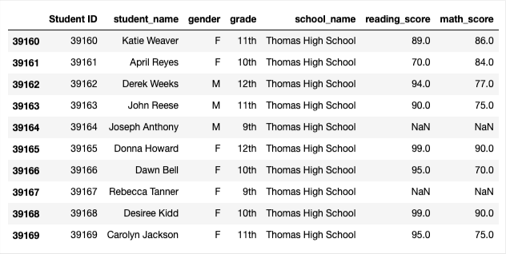
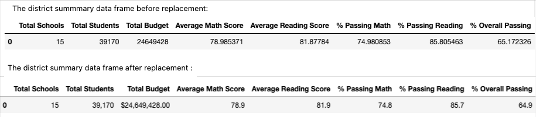
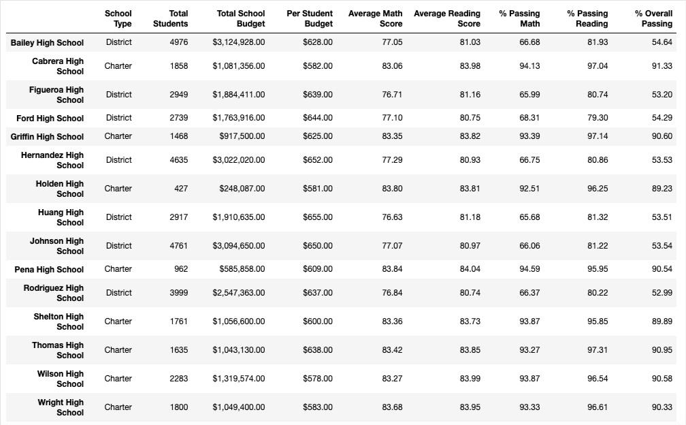
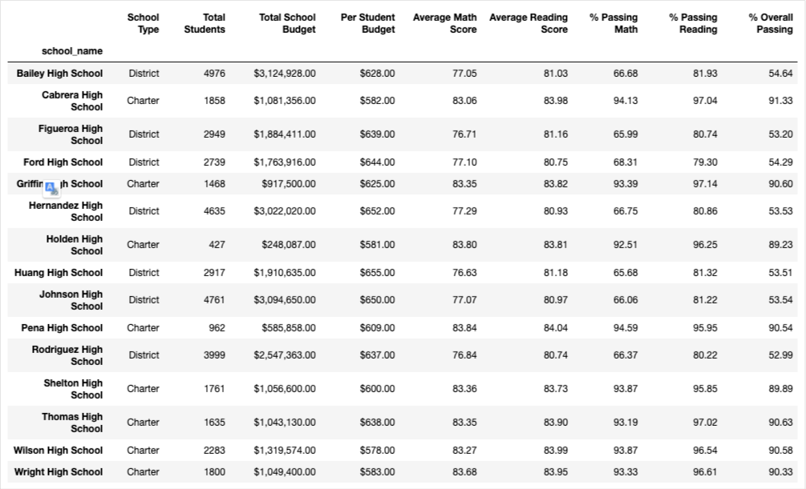
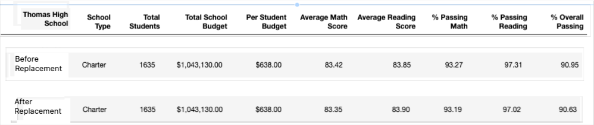
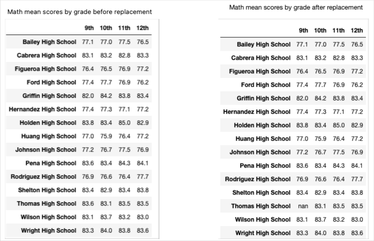
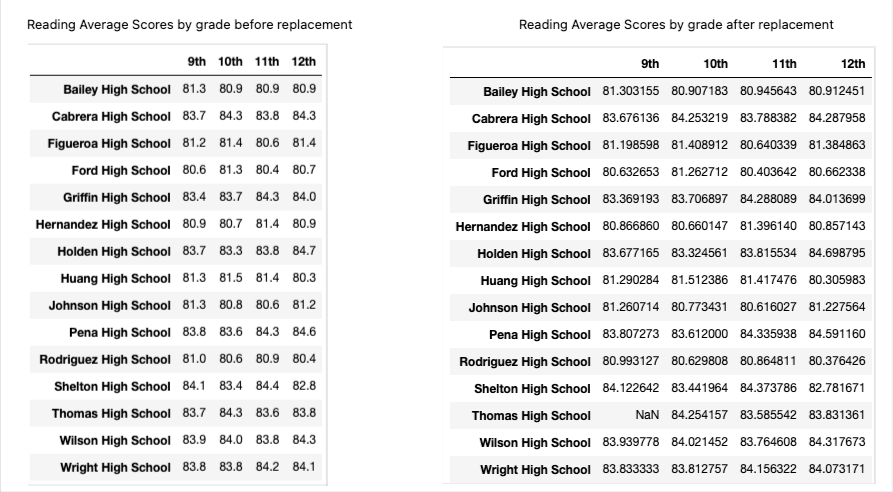
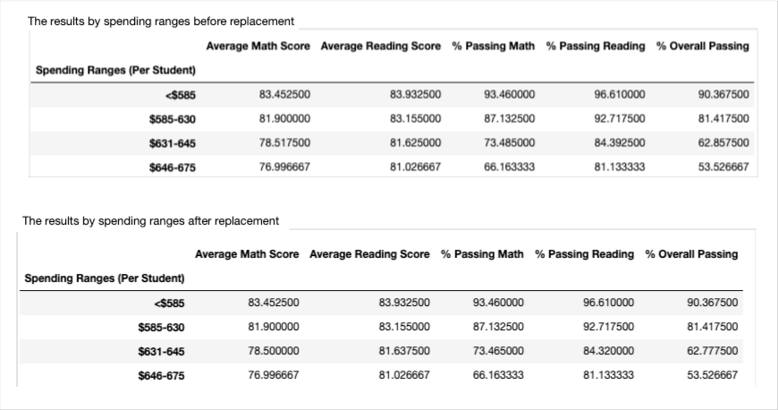
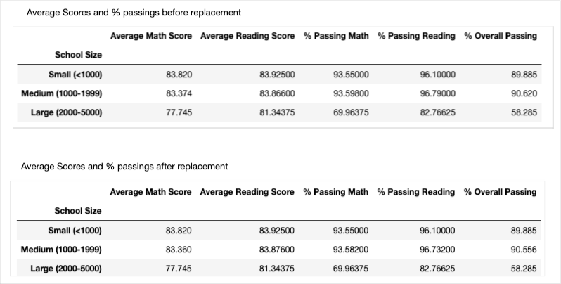
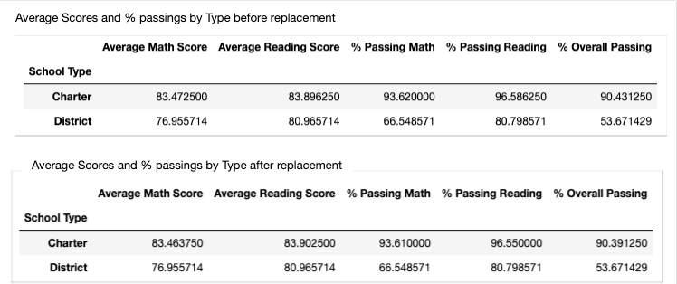

# School_District_Analysis
## Overview
This is an analysis of math and reading scores of 15 schools of a district by using documents  and  

The school board has  that the students_complete.csv file shows evidence of academic dishonesty; specifically, reading and math grades for Thomas High School ninth graders appear to have been altered. Since the school board does not know the full extent of the academic dishonesty, in order to do an acurate analysis, the math and reading scores for Thomas High School were replaced with NaNs while keeping the rest of the data intact.

First analysis has  done without this replacement and then it has done with the replacement and the reasults are discussed in this report.

### Purpose

The purpose is to see how to use loc method in pandas to replace the altered data with NaNs for more acurate analysis and to examine how effect this change on the overall analysis.   

## Results of Analysis and essential points of the code

The loc method has been used to to replace the scores which supposed to be altered with NaNs, the codes are as follows:

> student_data_df.loc[(student_data_df["grade"]=="9th") & (student_data_df["school_name"]=="Thomas High School"),["reading_score"]]=np.nan

> student_data_df.loc[(student_data_df["grade"]=="9th") & (student_data_df["school_name"]=="Thomas High School"),["math_score"]]=np.nan

The the last 10 rows of data frame named "student_data_df" will appeare after that as

 

In this frame one cen easily see that the math and reading scores of 9th grade students at Thomas High School (THS) are replaced with NaN and all ather data remained as it was.

### The affect of  replacing the ninth graders’ math and reading scores the district summary

In establishing the data farme "district_summary_df", "new_students_count" was defined as the total number of studennts minus the number of the ninth grade students at THS. Because, to find percentage of passing students it has been used. The number of ninth grader students at THS is calculated by the code

> ninth_grade_at_ths_count=school_data_complete_df[(school_data_complete_df["grade"]=="9th") & (school_data_complete_df["school_name"]=="Thomas High School")].count()["student_name"]

Data frames before and after replacement are given in the following figure:

If we compare data frames, we can see that average reading scores are almost the same, average math score, passing math percentage, passing reading percentage and overall passing percentage decreased a little bit after replacemnet. In fact there is no significant change. 

### The affect of  replacing the ninth graders’ math and reading scores on the school summary 

In establishing the data frame "per_school_summary_df", the series "nem_per_school_counts" was defined to use ti calculate perrcentages of passing of math, reading and overall, in which 9th grade students at THS are not included. It is established by the code

> new_per_school_counts=school_data_complete_df.groupby(["school_name"]).count()["math_score"]

I have used here the simple fact that math score does not include 9th grade students at THS, they are all NaN and NaNs are not taken acount in any calculations. This simple manipulation provides Step 5 to Step 14 in the deliveriable 2 to be brought out. That is why in  spteps are empty.

The summary of schools' resullst beofre replacement:

The summary of schools' resullst after replacement:

The average scores and passsing percentages of all schools except THS are the same, as we expect.

### The affect of  replacing the ninth graders’ math and reading scores at the Thomas High School’s performance relative to the other schools

In the following figure, the results of THS before and after replacement are demonstrated.

According to this table, average math score, passing math percentage and overall passing percentage decrease after replacement. Altough, average raeding score increased a little, the passing reading percent ,interestingly, decreased as well after replacement.

### The affect of  replacing the ninth graders’ math and reading scores to general analysis
### In terms of Math and reading scores by grade

Math averages by grade before and after replacement:

Reading averages by grade before and after replacement:

There is no change in any result of any grade at any school except 9th grade at THS, as we expect.

### In terms of scores by spending

In the following figure, the results by spending ranges before and after replacement are demonstrated.

There is a little change in only one range which is $631-$645, this is because THS takes place in this range. In all other ranges all resulsts are the same before and after replacement.

### In terms of scores by size

In the following figure, the results by size before and after replacement are demonstrated.

There is a little change in only one size which is medium (1000-1999), in fact THS has 1635 students takes place in this size. In all other sizes all resulsts are the same before and after replacement.

### In terms of scores by school type

Since THS is a charter school there is small change in the result of charter schools. In the district schools there is no change before and after replacement. This can be observed in the following table:

## Summary

